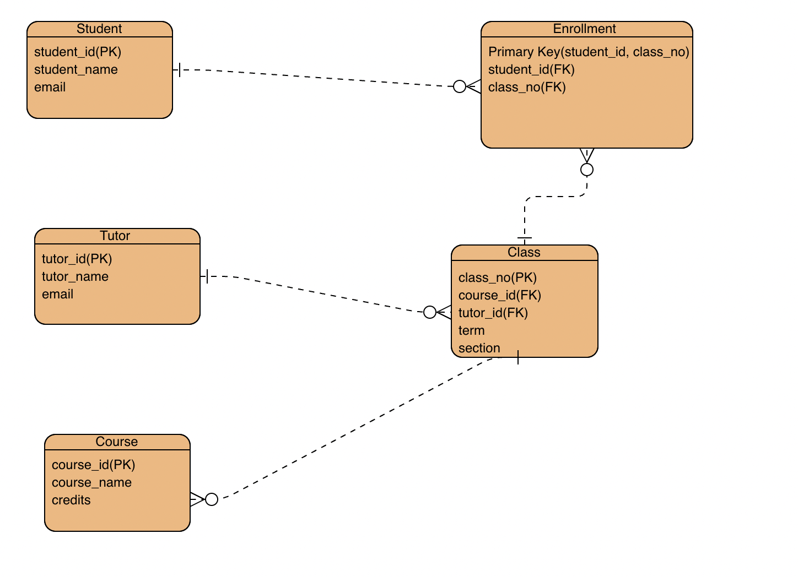

#  Database for YB College:
## 1. Project scope:
Yoobee College offers a variety of courses for students, including Design, Technology, Animation, Film, and Marketing. To support the management of academic data, a centralized database is needed. This database will store and organize information about students, tutors, classes, and enrollments. The goal is to clearly represent the relationships between these entities, improve data accessibility, and reduce errors caused by manual record-keeping.

## 2. Entities and EER diagram
#### Student: Stores information about enrolled students.
Attribute: 
·student_id(PK)
·student_name
·email 

#### Tutor: Stores information about tutors who teach classes.
Attribute: 
·tutor_id(PK)
·tutor_name
·email

#### Class: Represents an instance of a course being offered, including section and schedule information.
Attribute: 
·class_no(PK)
·course_id(FK)
·tutor_id(FK)
·term
·section

#### Course: Represents academic subjects offered by the college.
Attribute: 
·course_id(PK)
·course_name
·credits

#### Enrollment: Represents the relationship between students and classes. A student can enroll in multiple classes, and each class can have multiple students.
Attribute: 
·Primary Key(student_id, class_no)
·student_id(FK)
·class_no(FK)

## 3. Table design
We require 5 tables in total after mapping the EER diagram to a relational schema: Student, Tutor, Course, Class, and Enrollment.
The Enrollment table has a composite primary key of (student_id, class_no) to ensure a student is not enrolled in the same class more than once.
All relationships are implemented using foreign keys to enforce referential integrity between the tables.
#### Student Table

| Attribute     | Data Type      | Constraint      |
|---------------|----------------|-----------------|
| student_id    | INT            | PRIMARY KEY     |
| student_name  | VARCHAR(100)   | NOT NULL        |
| email         | VARCHAR(100)   | UNIQUE          |

#### Tutor Table

| Attribute     | Data Type      | Constraint      |
|---------------|----------------|-----------------|
| tutor_id      | INT            | PRIMARY KEY     |
| tutor_name    | VARCHAR(100)   | NOT NULL        |
| email         | VARCHAR(100)   | UNIQUE          |

#### Course Table

| Attribute     | Data Type      | Constraint      |
|---------------|----------------|-----------------|
| course_id   | INT            | PRIMARY KEY     |
| course_name | VARCHAR(100)   | NOT NULL        |
| credits     | INT            | NOT NULL        |

#### Class Table

| Attribute     | Data Type      | Constraint      |
|---------------|----------------|-----------------|
| class_no      | INT            | PRIMARY KEY     |
| course_id     | INT            | FOREIGN KEY REFERENCES Course(course_id) |
| tutor_id      | INT            | FOREIGN KEY REFERENCES Tutor(tutor_id)   |
| term          | VARCHAR(20)    |  NOT NULL   |
| section       | VARCHAR(20)    |  NOT NULL   |

#### Enrollment Table

| Attribute     | Data Type      | Constraint      |
|---------------|----------------|-----------------|
| student_id    | INT            | FOREIGN KEY REFERENCES Student(student_id)          |
| class_no      | INT            | FOREIGN KEY REFERENCES Class(class_no)              |

*Composite primary key on (student_id, class_no) ensures each student can enroll in the same class only once.*
