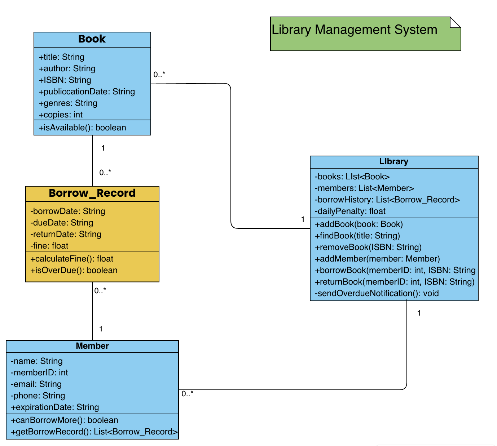
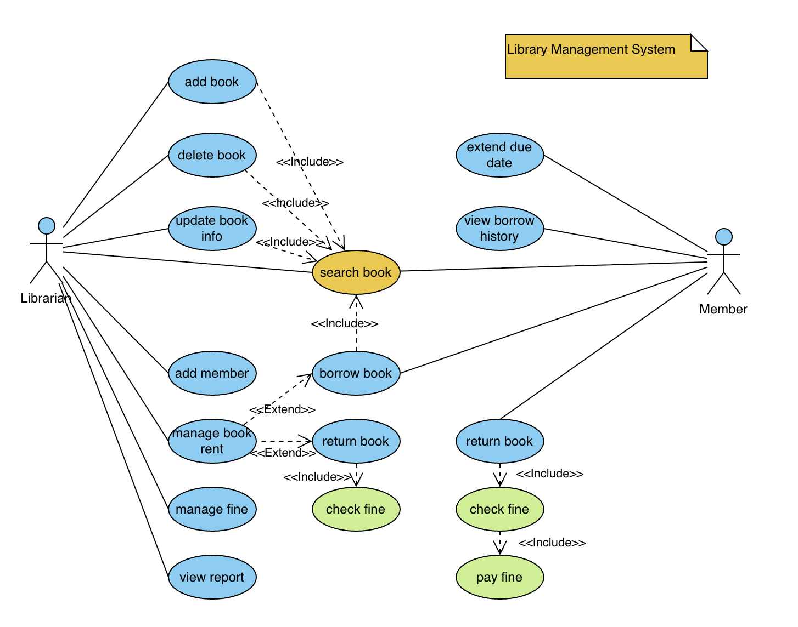
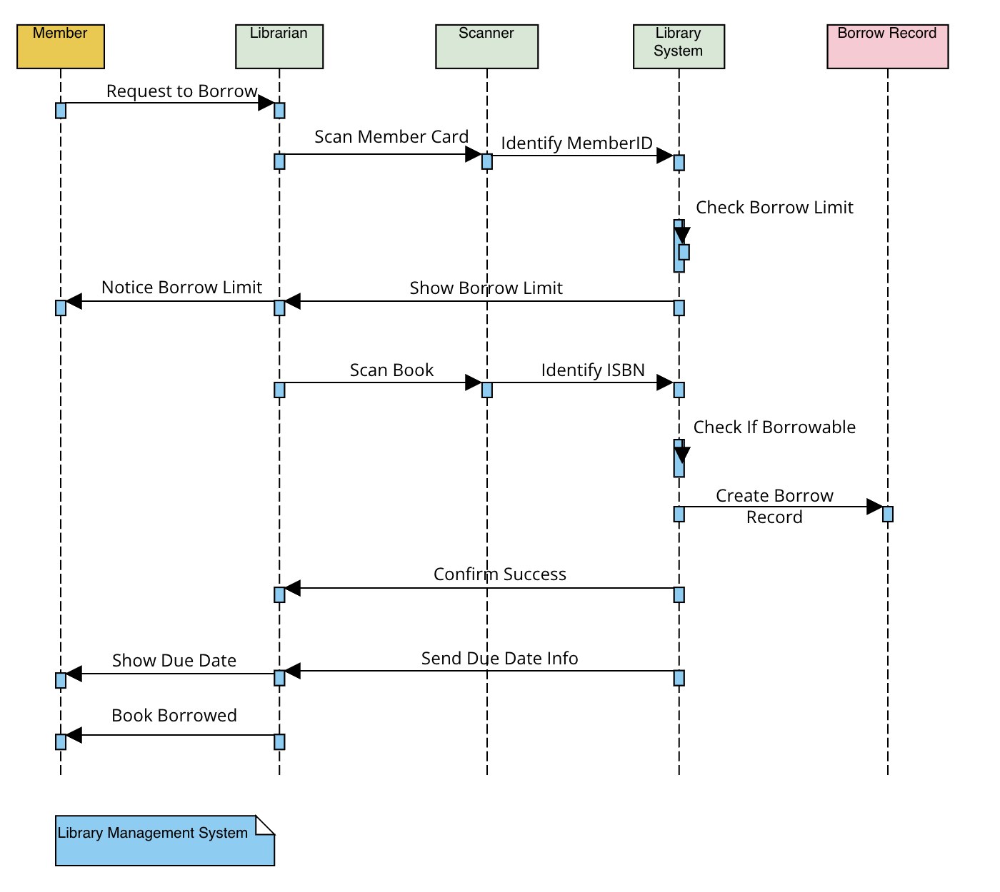
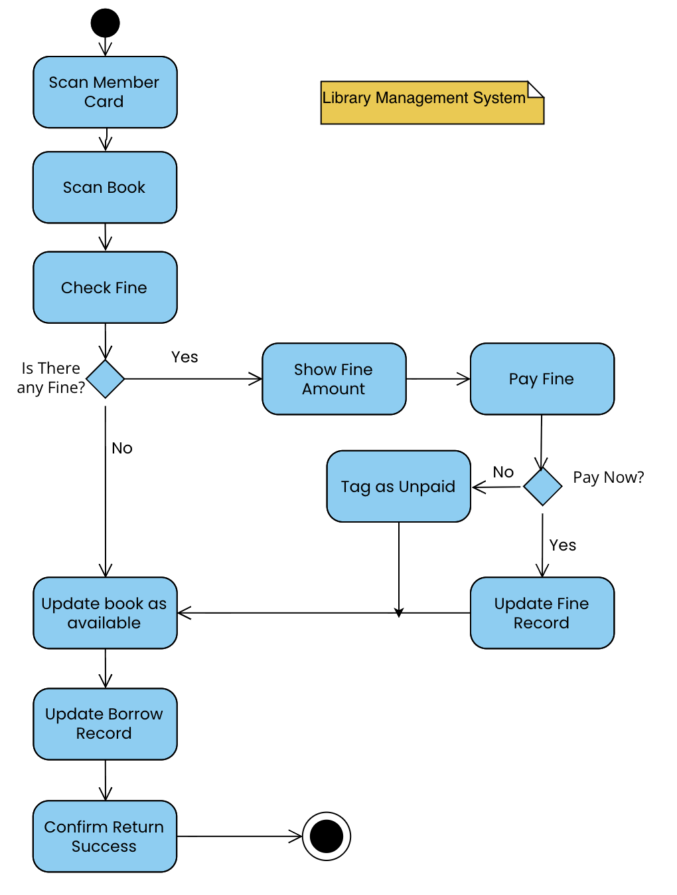

# Library Management System

## 1. Project Scope

The **Library Management System** is designed to facilitate the daily operations of a library by providing tools for:

- Book management (add/update/delete/search)
- Member registration and record tracking
- Book borrowing and returning
- Fine calculation and payment

The system helps **librarians** and **members** by automating manual tasks, keeping consistent borrowing records, enforcing borrow limits, and handling overdue fines.

---

## 2. Class Diagram

### Key Classes

- **Book**
  - Attributes: `title`, `author`, `ISBN`, `publicationDate`, `genres`, `copies`
  - Method: `isAvailable()`
- **Member**
  - Attributes: `name`, `memberID`, `email`, `phone`, `expirationDate`
  - Method: `canBorrowMore()`, `getBorrowRecord()`
- **Borrow_Record**
  - Attributes: `borrowDate`, `dueDate`, `returnDate`, `fine`
  - Methods: `calculateFine()`, `isOverDue()`
- **Library**
  - Attributes: `books`, `members`, `borrowHistory`, `dailyPenalty`
  - Methods: `addBook()`, `findBook()`, `removeBook()`, `addMember()`, `borrowBook()`, `returnBook()`, `sendOverdueNotification()`

> This structure supports encapsulation and clear object-oriented relationships.

---

## 3. Use Case Diagram

### Actors

- **Librarian**
  - Can add/edit/delete books, add members, manage fines, and view reports.
- **Member**
  - Can search, borrow, return books, and pay fines.

### Features

- `<<include>>`: Indicates mandatory dependencies, e.g., borrowing a book includes searching for it.
- `<<extend>>`: Indicates optional or conditional behavior, e.g., returning a book may extend to checking and paying fines.

> This model outlines all interactions between users and the system.

---

## 4. Sequence Diagram

### Borrow Book Process

1. **Member** requests to borrow a book.
2. **Librarian** scans the member card and the book.
3. **Scanner** reads and sends member ID and ISBN.
4. **System**:
   - Checks member’s borrow limit.
   - Verifies book availability.
   - Creates a `Borrow_Record`.
   - Sends confirmation and due date.

> This diagram clearly shows the interaction among components like scanner, system, and database.

---

## 5. Activity Diagram

### Return Book & Fine Process

1. Scan member card.
2. Scan book to be returned.
3. Check if there is any fine.
4. If there is a fine:
   - Show fine amount.
   - Ask if member wants to pay now.
     - If yes: process payment and update fine record.
     - If no: tag as unpaid.
5. Update book status to available.
6. Update borrow record.
7. Confirm return success.

> This flow ensures books are returned even when fines are unpaid, improving accessibility while still tracking dues.

---
